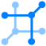
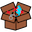
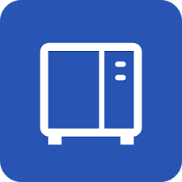

# Homer Icons

[Homer Dashboard](https://github.com/bastienwirtz/homer)

                                                                                                                                                                                                                                                                                                                                 
