# Dashboard Icons

### The best Dashboards:

- [Homer Dashboard](https://github.com/bastienwirtz/homer)
- [Heimdall](https://github.com/linuxserver/Heimdall)
- [Organizr (v2)](https://github.com/causefx/Organizr)
- [Dashy](https://github.com/Lissy93/dashy)
- [Flame](https://github.com/pawelmalak/flame)
- [SUI](https://github.com/jeroenpardon/sui)


##### [How to download images on UNIX?](#how-to-download-images-on-unix)


 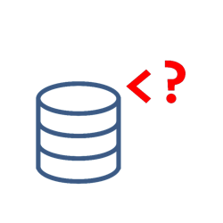           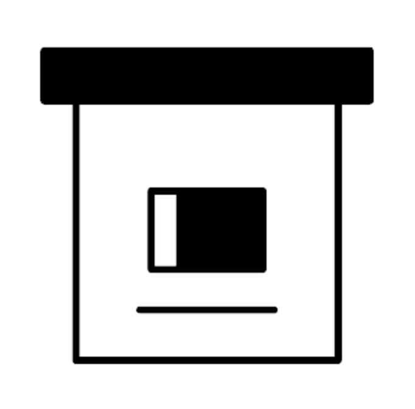  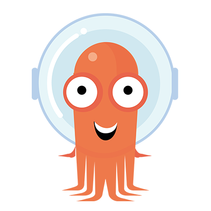  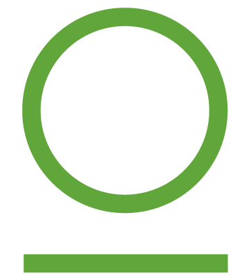  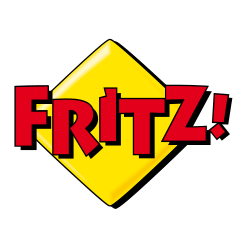 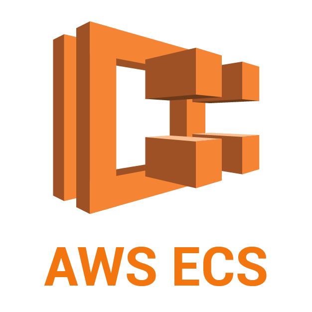          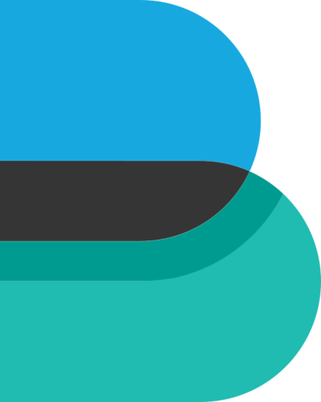 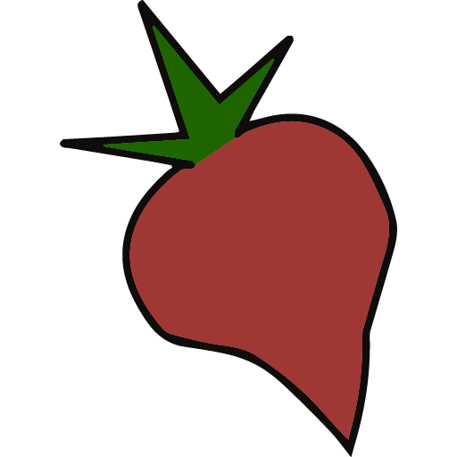         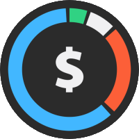 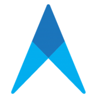                         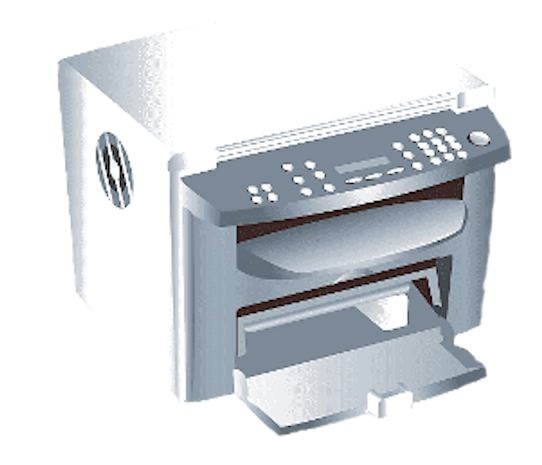 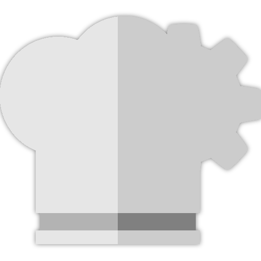      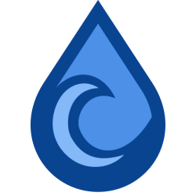      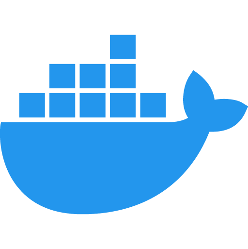           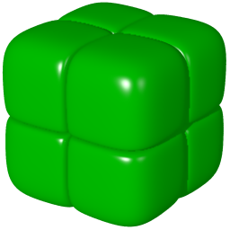    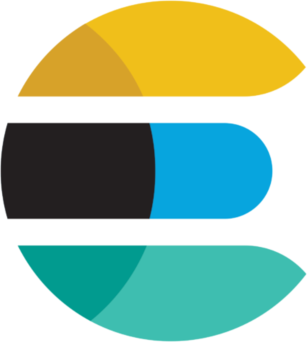 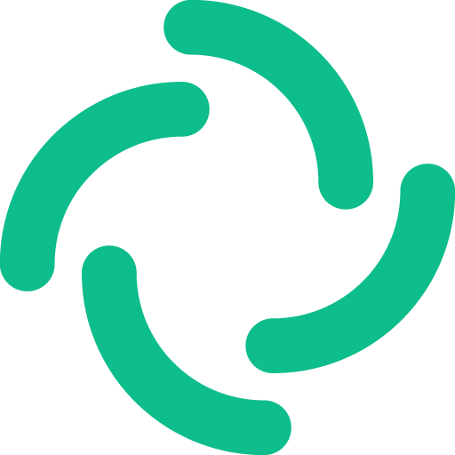             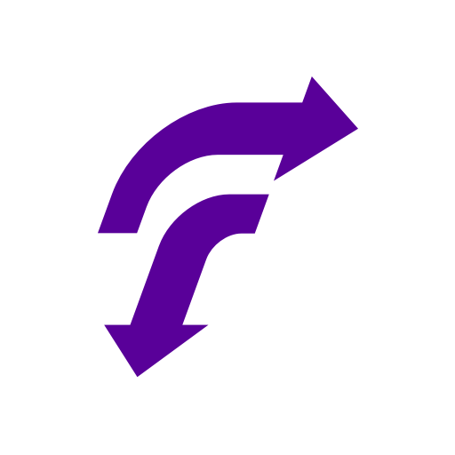    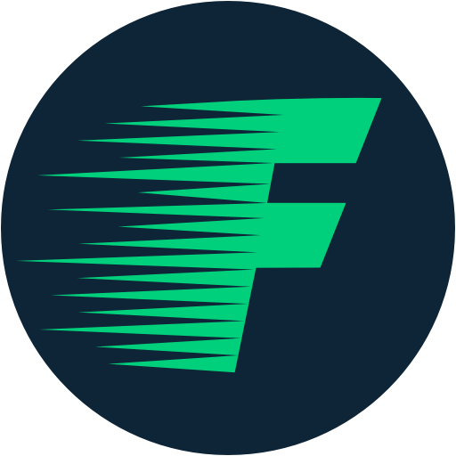  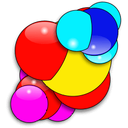     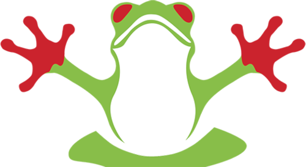 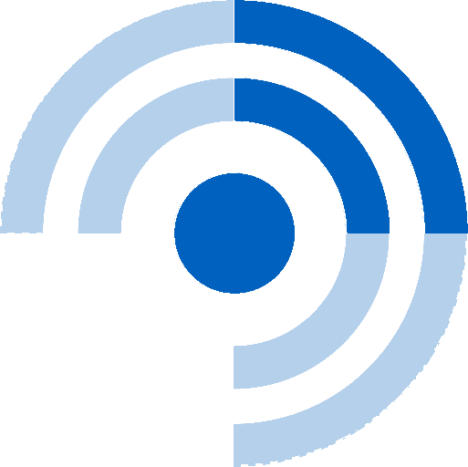            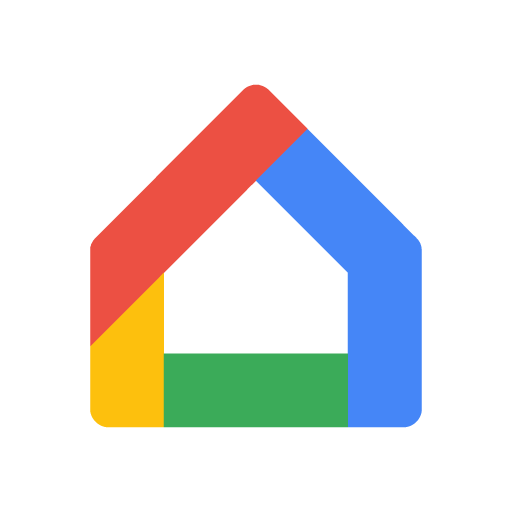           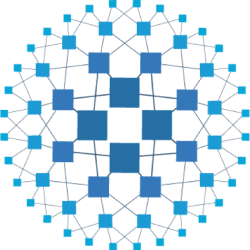      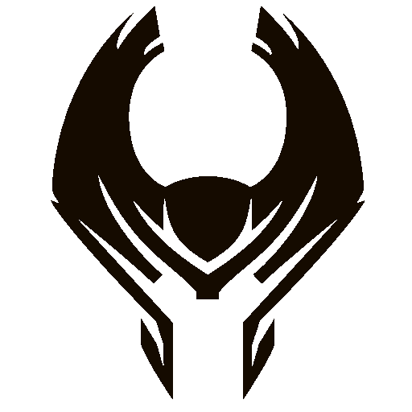  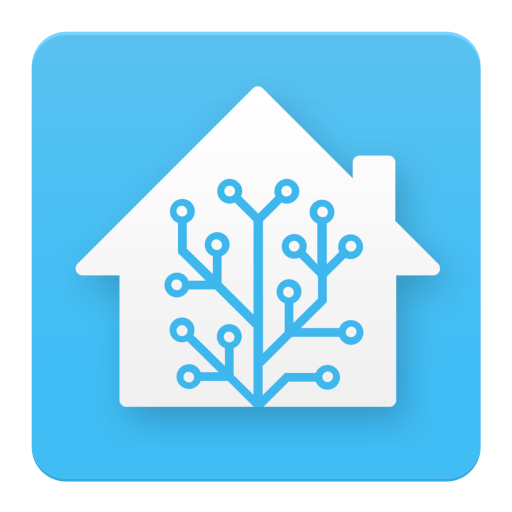  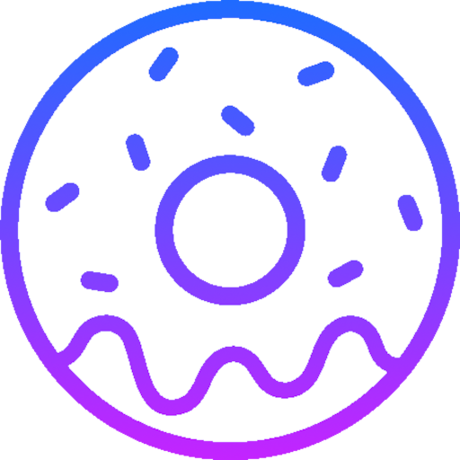       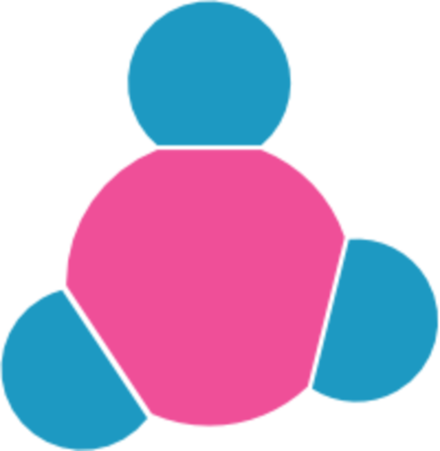   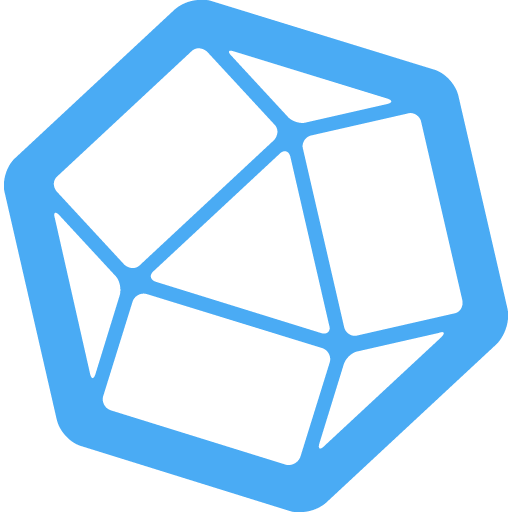 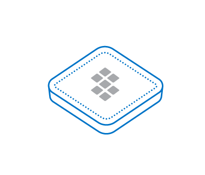    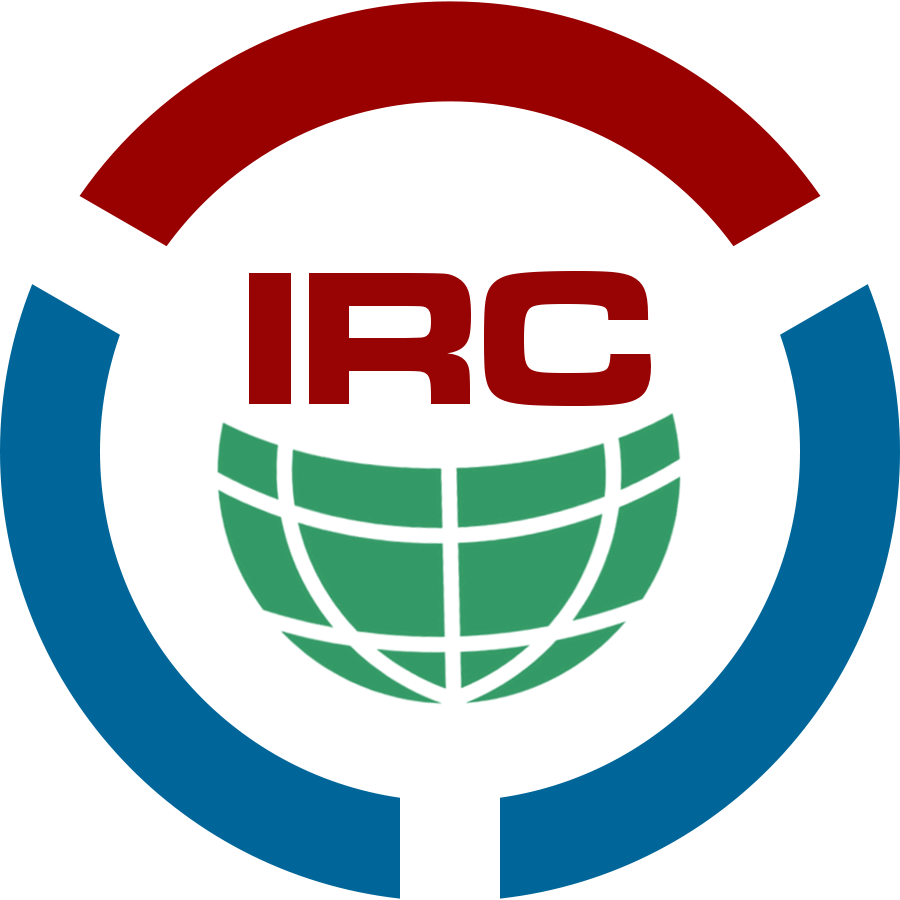   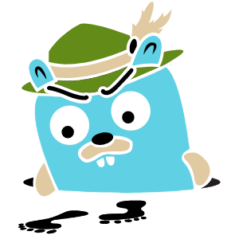                 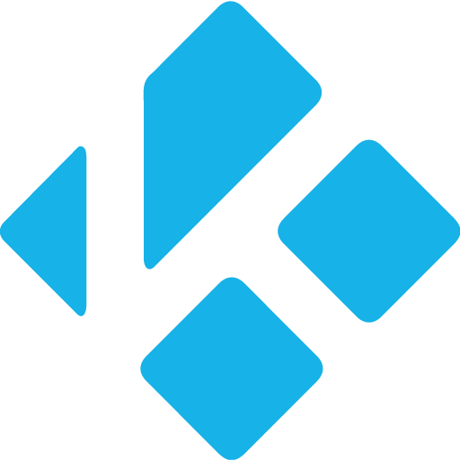  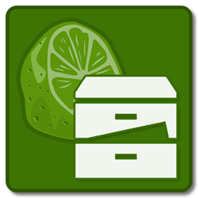  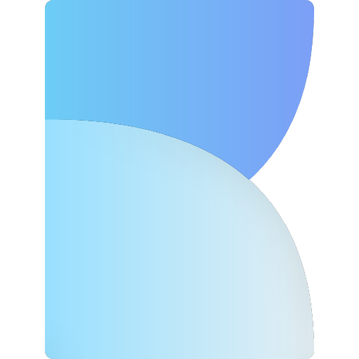       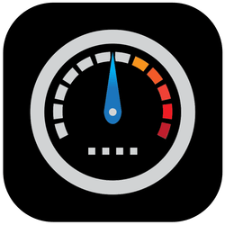   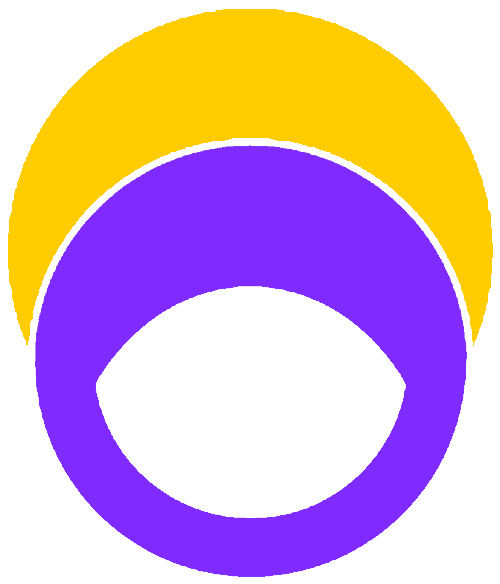                      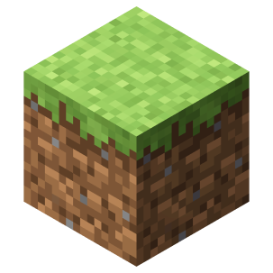 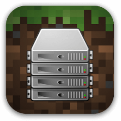  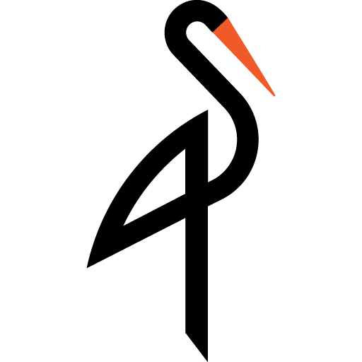 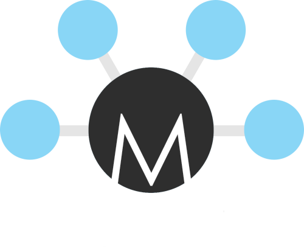     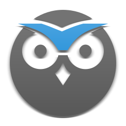     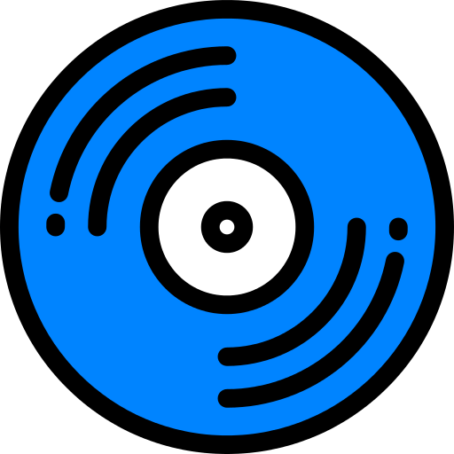   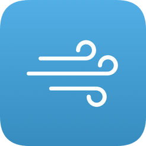   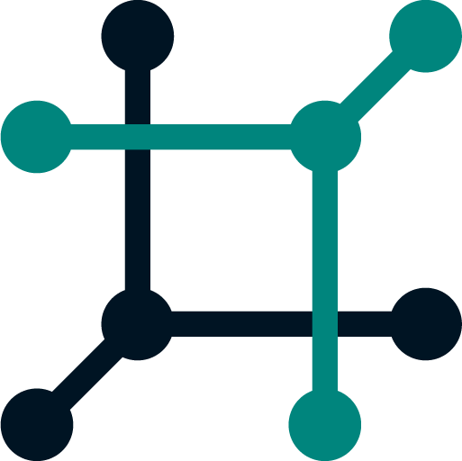  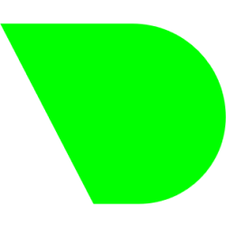   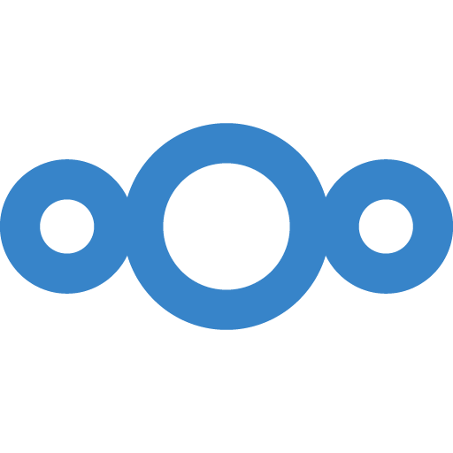 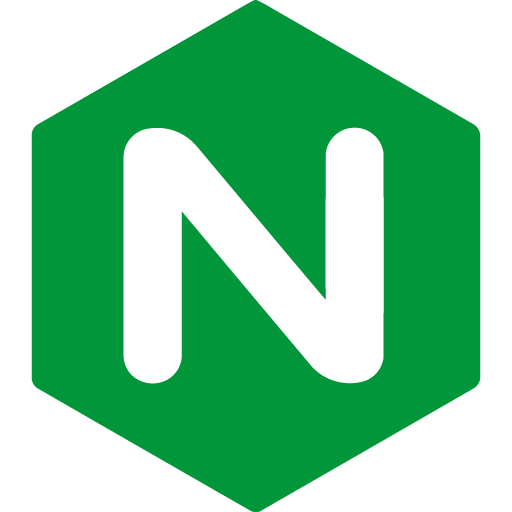       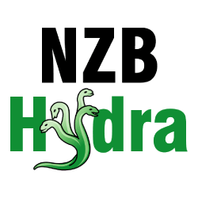          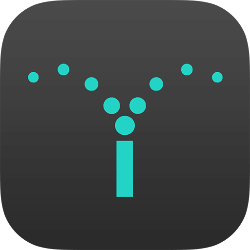                                                                                                                                                                                              


---

### How to download images on UNIX?


`UNIX`

```bash

$ curl https://raw.githubusercontent.com/WalkxCode/dashboard-icons/master/png/example.png > example.png

```
or
```bash

$ wget https://raw.githubusercontent.com/WalkxCode/dashboard-icons/master/png/example.png -O example.png

```


---

## Trademark Legal Notices

(Almost) All product names, trademarks and registered trademarks in the images in this repository, are property of their respective owners. All images in this repository are used by the users of the Dashboard Icons project for identification purposes only.


The use of these names, trademarks and brands appearing in these image files, do not imply endorsement.